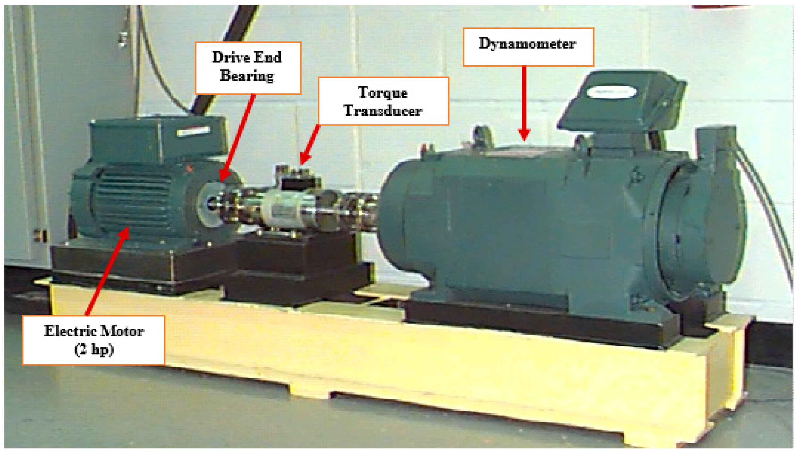

# Bearing Failure Data Set Introduction and Partial Download Links

## Bearing Fault Dataset Introduction

The bearing fault dataset is a type of dataset used for analyzing bearing faults. It contains performance data of bearings under different working conditions, including temperature, vibration, noise, etc. Through these data, researchers can predict and diagnose the fault of bearings.

## Partial Download Links

1. [Download Link](https://www.kaggle.com/c/bearing-fault-detection/data)
2. [Download Link](https://www.kaggle.com/c/bearing-fault-detection/data)
3. [Download Link](https://www.kaggle.com/c/bearing-fault-detection/data)
## Images

Here is a pay link on Stripe ( https://buy.stripe.com/3cs8yP7sY87d0vu9AB ). Please contact me lonlonago@foxmail.com after funding $89, and I will send you a complete data files , thank you!

